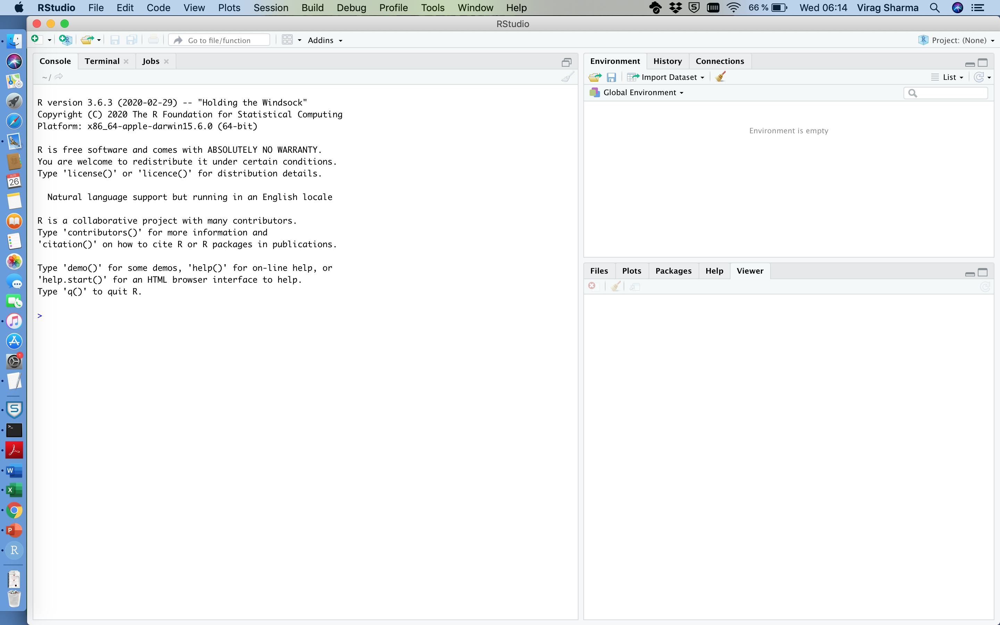
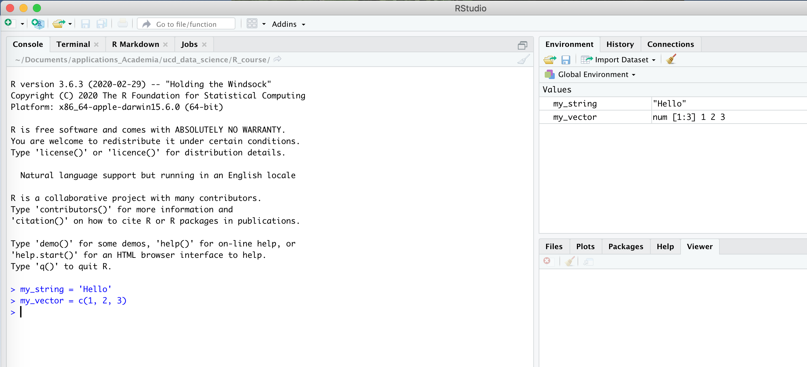
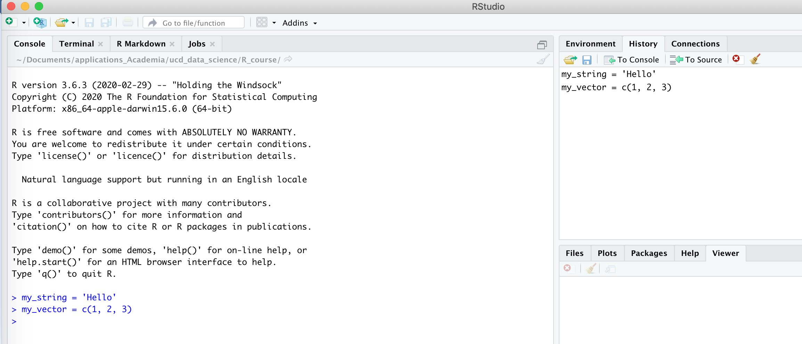
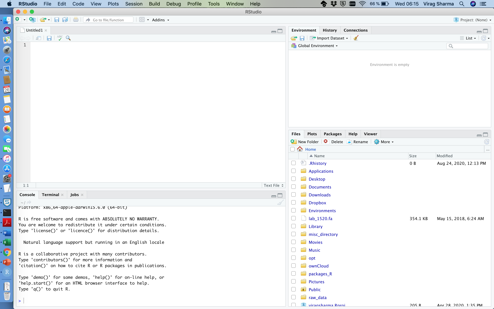

An introduction to RStudio
================
Virag Sharma

We are going to talk about RStudio in this tutorial. As I have mentioned
this in the previous tutorial, RStudio provides a friendly environment
to type your R-code but that is what RStudio is all about.

If we open a fresh instance of RStudio, we normally see three
panes/windows.



The one on the left is spread throughout the left column while there are
2 panes on the right side of your screen.  
The left pane is called the R-console and we will make use of it
throughout this course. Basically, this is the place where you type in
your code/commands.

Let us go to the two panes on the right.  
The one on the top says **Environment**, **History** and
**Connections**. Sounds interesting, isn’t it?.  
We will have a look at the Environment and the History tab in this
tutorial. If you click on each ones of them indivudally, you won’t find
any content there.

**Environment Tab** - You see a greyed message here stating that
‘Environment is empty’.


**History Tab** - The History tab is empty as well.


### Environment

To see how this can be really useful to us, let us set a couple of
variables in R

``` r
my_string = 'Hello'
my_vector = c(1, 2, 3)
```

You may not understand the vector notation at this point but for the
time being, simply consider that the variable *my\_vector* is a list of
three numbers - 1, 2 and 3.  
Ok, have you noticed the **Environment tab** on the right side of your
screen.  


It is now getting populated with the objects that you have just created.
This gets extremely useful when you are dealing with code that involves
many variables/objects. The **Environment tab** gives you a list of all
the variables you have created and their values.  
Notice that this tab will hold the current value of the variable. So if
we were to reassign *my\_string* to some other string, then you will see
this value in the current environment.


### History

We have seen the Environment tab getting populated with the objects that
we have created. But we did not pay heed to the History tab. Ok, let us
click there: 

Cool\!\! So the History tab, is very much a recorder and is recording
all the code/commands that we have typed in the R-console. Again, this
gets extremely useful when you are trying out a few things by typing
code in your R-console and at some point you may have forgotten what you
did. In principle, you could copy all the commands from your History tab
to a file, keep only the ones that are really needed and then create an
R-script from it.

The bottom pane on the right side of your screen has five tabs - Files,
Plots, Packages, Help and Viewer.  
**Files** – Lists the files that are present in your working directory
(more on this in a while).  
**Plots** – This pane becomes useful when we get into plotting.  
**Packages** – This pane lists the packages that we have installed.
Again, no need to fret about this now, we will learn about packages very
soon.  
**Help** – This pane provides documentation about the packages that have
been installed

## RStudio’s fourth eye

We have normally seen that there are three panes/windows in RStudio but
we can invoke a fourth pane by doing the following: 

What does this do? As we can see, this invokes a fourth pane:

 At the
moment, this is called **Untitled1** but like you would do with any
other application, say Word or Excel, you could save this as a file
somewhere on your disk.  
Also note that I opened a **Text File** but more often that not, you are
likey to use the **R Script** option which is the first choice you could
make from the **New File** menu.

The most useful function of this pane is to be able to write an Rscript
as you type in commands in your console. I have stated before that you
could make use of the **History** pane on your right to find out which
commands you typed in. What you could also do is the following:  
Once you type in a command and you know you are going to use it in the
future, you could simply copy the same command from your console to this
pane and save it as a R-script for future use.

Alternatively, you could also open a new session with RStudio and open a
script (that you wrote at some point before) in this pane. Now assuming
that you need not run the entire workflow from the Rscript but only a
few commands, you could copy these commands from your script and keep
pasting them in the R-console until you are done.
